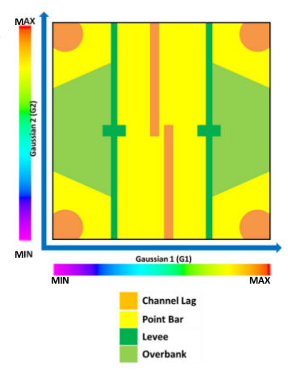
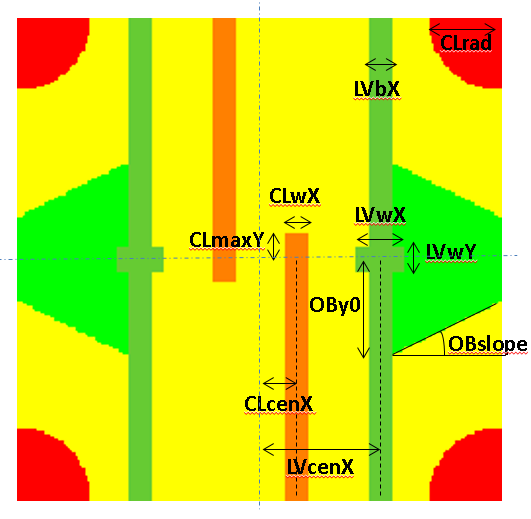

```{r Loading Library, include=FALSE}
library(RGeostats)
library(fields)
library(fmsb)
library(RFlumy)
```

```{r Global setup, include=FALSE}
knitr::opts_chunk$set(echo = TRUE, fig.align="center")
rm(list=ls())
```

```{r Global variables, message=FALSE, include=FALSE, warning=FALSE}
constant.define("asp",1)
image.dir = "images/"
flag.plot = TRUE
flag.png = TRUE
flag.csv = TRUE
if (flag.png) dir.create(image.dir, F)
# Flumy Facies Colormap

# Color of facies with RGB components
col.flumy = rbind(
  # Channel Lag (CL)
  c(1.00,0.50,0.00),
  # Point Bar / LAPs (PB)
  c(1.00,1.00,0.00),
  # Sand Plug (SP)
  c(0.75, 0.75,0.55),
  # Crevasse Splay I (CSI)
  c(0.80, 0.50, 0.20),
  # Splay II Channels (CCh)
  c(0.80, 1.00, 0.20),
  # Crevasse Splay II (CSII)
  c(0.80, 0.80, 0.20),
  # Levee (LV)
  c(0.40, 0.80, 0.20),
  # Overbank (OB)
  c(0.00, 1.00, 0.00),
  # Mud Plug (MP)
  c(0.00, 0.80, 0.50),
  # Channel Fill (CF)
  c(0.50, 0.50, 0.50),
  # Wetland (WL)
  c(0.85, 0.45, 0.85),
  # Draping (DR)
  c(0.60, 0.80, 0.90),
  # Pelagic (PL)
  c(1.00, 0.80, 1.00))
  
# Convert into hexadecimal colorscale
col.flumy = rgb(matrix(as.integer(col.flumy*256),length(col.flumy)/3,3), maxColorValue = 256)
```

# Introduction

This document is a sensitivity analysis of the particular lithotype rules provided by ENI for performing PGS simulations. It has been generated using RStudio from an RMarkdown file. The procedures described here use RGeostats package available at http://cg.ensmp.fr/rgeostats. They are under development and this analysis still need some improvements.

# Parametrization

## Creating the Grid

The demonstration is performed on a 3D grid. Note that we will not taking into account the global meandering shape of the channel belt (directional trend). Instead we will define a straight elongated grid (15km x 5km) half shorter than the Alpha reservoir domain (~30km x 5km). This elongated shape will govern the main anisotropy axis. The cell dimension is 50m x 50m x 2m; the grid thickness is 100m.

```{r Creating Grid}
grid0 = db.create(nx=c(300,100,50),dx=c(50,50,2))
```

## Model

First we define the parameters of the two underlying gaussian random functions by using the one provided by ENI for Alpha reservoir:

* the long range model is strongly anisotropic (in the horizontal direction of the grid main axis): it uses a regular basic structure (*gaussian*)

* the second structure is a short range isotropic periodic basic structure (*J-Bessel*) with a very short vertical range

```{r Model definition}
model1 = model.create(vartype="Nugget Effect",sill=0.0001,ndim=3)
model1 = model.create(vartype="Gaussian",range=c(7674,339,11),ndim=3,model=model1)
model2 = model.create(vartype="Nugget Effect",sill=0.02,ndim=3)
model2 = model.create(vartype="Gaussian",sill=0.49,range=c(7674,339,11),ndim=3,model=model2)
model2 = model.create(vartype="Gaussian",sill=0.49,range=c(7674,339,10),aniso.angles=c(0,35,0),ndim=3,model=model2)
```

# Non conditional simulations

We first compute the non-conditional simulations on the nodes of the grid. If the user whishes to generate a new set of outcomes, he must simply modify the seed used for random number generation. Covariance models can also be adjusted by modifying model1 and model2 at the beginning.

```{r Non-conditional simulations on the grid}
init.grid <- function(grid0, seed1=43243, seed2=123456, nbtuba=100, nbsimu=1)
{
  grid = simtub(NA,grid0,model=model1,nbtuba=nbtuba,seed=seed1,
                nbsimu=nbsimu,radix="G1")
  grid = simtub(NA,grid, model=model2,nbtuba=nbtuba,seed=seed2,
                nbsimu=nbsimu,radix="G2")
  grid
}
grid = init.grid(grid0)
```

We can now represent the two turning band simulation outcomes. Please, note that Gaussians from Alpha reservoir have been generated using SGS simulation (for G1) and SGS + Co-Kriging (for G2).

```{r Displaying gaussian simulations}
plot(grid,name="G1*",title="Simulation G1 - Slice",zlim=c(-3,3),pos.legend=1,col=rainbow(200,rev=T),asp=1)
plot(grid,name="G2*",title="Simulation G2 - Slice",zlim=c(-3,3),pos.legend=1,col=rainbow(200,rev=T),asp=1)
plot(grid,name="G1*",title="",zlim=c(-3,3),col=rainbow(200,rev=T),asp=1)
title("Simulation G1 - Slice", line=0.5)
plot(grid,name="G2*",title="",zlim=c(-3,3),col=rainbow(200,rev=T),asp=1)
title("Simulation G2 - Slice", line=0.5)
plot(grid,name="G1*",title="",zlim=c(-3,3),col=rainbow(200,rev=T),asp=0,pos.x=2,pos.y=3)
title("Simulation G1 - Cross-Section", line=0.5)
plot(grid,name="G2*",title="",zlim=c(-3,3),col=rainbow(200,rev=T),asp=0,pos.x=2,pos.y=3)
title("Simulation G2 - Cross-Section", line=0.5)
```

## Working in proportions

We need a bigaussian discretized probability matrix in order to calculate the probabiliy that a pair of independent Gaussian random variables vary within a rectangle specified by its extension along X and Y.

As the integral of the bigaussian density over an area of any shape is difficult, we imagine instead to discretize a given interval (which conventionally represents the whole domain of definition of a Gaussian) into a square grid.

```{r Bigaussian Discretization pre-calculation}
max_BG = 3  # Extension of the interval where to calculate the gaussian values [-3,+3]
nx_halfBG = 100  # Resolution of the discretization
# Grid parameters
nx_centerBG = nx_halfBG + 1
nx_BG = nx_halfBG * 2 + 1
dx_BG = 1 / nx_BG
# Grid construction
BG = matrix(c(nx_BG*nx_BG), nrow=nx_BG, ncol=nx_BG)
for (i in 1:nx_BG)
{
  for (j in 1:nx_BG)
  {
    # Gaussian values are inside [-max_BG, +max_BG]
    x = (i-nx_centerBG) * max_BG / nx_halfBG
    y = (j-nx_centerBG) * max_BG / nx_halfBG
    BG[i,j] = dnorm(x) * dnorm(y)
  }
}
# Nomalization so that sum(BG) is 1
BG = BG / sum(BG)
x = y = seq(-max_BG, max_BG, length.out = nx_BG)
image.plot(x, y, BG, main="Bigaussian discretized grid", asp=1)
```

## Color scale

We define the procedure in order to **convert** the outcomes of the two underlying gaussian random functions into a 5-facies map (Channel Lag will be dissociated into 2 facies (orange + red)).

We first define the set of colors and ids used for future graphic representations (same as Flumy except for Channel Lag)

```{r Facies definition}
# Keep facies order by grain size increasing
nbfac = 5
fac.colors = c(col.flumy[1],"red",col.flumy[2],col.flumy[7],col.flumy[8])
fac.labels = c("CL1", "CL2", "PB", "LV", "OB")
fac.id = as.data.frame(as.list(seq(1,nbfac)),col.names=fac.labels)
```

## Truncation scheme

We try to mimic the lithotype rule as defined by ENI and displayed in the next figure:  



This truncation scheme can be described using several parameters:

* for Channel Lag (orange):
    + the radius of the circles on the four corners of the graph (**CLrad**)
    + the center (**CLcenX**) and width (**CLwX**) as well as the maximum along Y (**CLmaxY**) of the right most central band
* for Levees (dark green):
    + the central location along X (**LVcenX**) and the width of the band (**LVbX**) for the rightmost vertical band
    + the width along X (**LVwX**) and along Y (**LVwY**) of the rectangular shapes 
* for Overbank (light green):
    + the slope of the boundary (**OBslope**) between the Point Bar and the Overbank domain in the lower right corner of the truncation scheme (dy/dx)
    + the vertical offset (**OBy0**) of the Overbank right trapeze origin from the center



# Internal functions

We define several internal functions:

- **dist2** to calculate the squared distance between two points

```{r Function dist2}
dist2 <- function(p1,p2,c1,c2)
{
  dist = (p1 - c1) * (p1 - c1) + (p2 - c2) * (p2 - c2)
  dist
}
```

- **patch.params** to patch the default rule parameter values either by multiplying one parameter or setting it a new value

```{r Function patch.params}
patch.params <- function(index = 0, factor = 1, value = NA)
{
  # default setup
  params = list(
  CLrad   = 0.3*max_BG,
  CLcenX  = 0.15*max_BG,
  CLwX    = 0.1*max_BG,
  CLmaxY  = 0.1*max_BG,
  LVcenX  = 0.5*max_BG,
  LVbX    = 0.1*max_BG,
  LVwX    = 0.2*max_BG,
  LVwY    = 0.1*max_BG,
  OBslope = 0.5,   # dy / dx
  OBy0    = 0.4*max_BG)
  msg     = "Z. Default"
  
  if (!miss(factor) || !miss(value))
  {
    if (index > 0 && index <= length(params))
    {
      if (miss(value))
      {
        new_val = as.numeric(params[index]) * factor
        if (new_val > 0)
        {
          params[index] = new_val
          msg = paste(names(params[index]), "x", factor)
        }
        else
        {
          msg = paste(names(params[index]), " unchanged!")
        }
      }
      else
      {
        new_val = value
        if (new_val > 0)
        {
          params[index] = new_val
          msg = paste(names(params[index]), "=", value)
        }
        else
        {
          msg = paste(names(params[index]), " unchanged!")
        }
      }
    }
  }
  list(params=params,msg=msg)
}

# Store the number of parameters
nbpar = length(patch.params()$params)
```

- **truncate** to perform a truncation on an image with coordinates $(p1,p2)$ varying within $[-maxBG,+maxBG]$ intervals on both axes according particular ENI flag:

```{r Function truncate for ENI particular flag}
truncate <- function(p1,p2,p)
{
  nval = length(p1)

  # Set the background to PB
  facies = rep(fac.id$PB, nval)
  
  # Set the trapeze shapes to OB
  x0 = p$LVcenX + p$LVbX/2
  y0 = p$OBy0
  facies[(abs(p1) >= x0) & (abs(p2) < y0 - p$OBslope * (abs(p1) - x0) )] = fac.id$OB

  # Set the vertical bars to LV
  facies[abs(abs(p1) - p$LVcenX) < p$LVbX/2] = fac.id$LV

  # Set the horizontal rectangular shapes to LV bars
  facies[(abs(abs(p1) - p$LVcenX) < p$LVwX/2) & (abs(p2) < p$LVwY/2)] = fac.id$LV

  # Set the two vertical bands to CL
  facies[(abs(p1 - p$CLcenX) < p$CLwX/2) & (p2 <  p$CLmaxY)] = fac.id$CL1
  facies[(abs(p1 + p$CLcenX) < p$CLwX/2) & (p2 > -p$CLmaxY)] = fac.id$CL1

  # Set the CL circles in corners
  CLrad2 = p$CLrad * p$CLrad
  facies[(dist2(p1,p2, max_BG, max_BG) < CLrad2)] = fac.id$CL2
  facies[(dist2(p1,p2, max_BG,-max_BG) < CLrad2)] = fac.id$CL2
  facies[(dist2(p1,p2,-max_BG, max_BG) < CLrad2)] = fac.id$CL2
  facies[(dist2(p1,p2,-max_BG,-max_BG) < CLrad2)] = fac.id$CL2
  
  facies
}
```

- **display_rule** Check the truncation scheme by displaying it on a regular grid covering the interval $[-maxBG,+maxBG]$ along both axes. Then display theoretical and real proportions of each facies (if given).

```{r Displaying rule function}
display_rule <- function(params,props_th,props)
{
  asp = constant.query("asp")
  constant.define("asp",1)
  nx     = nx_halfBG
  dx     = max_BG / nx
  nval   = 2 * nx + 1
  rule   = db.create(nx=c(nval,nval),x0=c(-max_BG,-max_BG),dx=c(dx,dx))
  facies = truncate(rule[,"x1"],rule[,"x2"],params$params)
  rule   = db.add(rule,facies)
  
  props_stats = stats_from_prop(round(props_th,0))
  name = paste(params$msg,"[Rule]")
  title = paste(name,"\n",props_stats,sep="")
  if (flag.png)
  {
    file  = paste(image.dir,name,".png",sep='')
    png(file, width=380, height=380)
  }
  plot(rule,col=fac.colors,nfacies=length(fac.colors),title=title)
  if (flag.png) dev.off()
  
  constant.define("asp",asp)
  cat("\n")
  cat(unlist(lapply(names(params$params),function(x) {sprintf("%7s", x)})),"\n")
  cat(paste(unlist(lapply(params$params,function(x) {sprintf("%7g", x)})), collapse=" "),'\n')
  cat("\n")
  cat("Props(%) ", unlist(lapply(fac.labels,function(x) {sprintf("%7s", x)})),"\n")
  cat("Theor.   ", unlist(lapply(props_th,function(x) {sprintf("%7.2g", x)})),"\n")
  cat("Real     ", unlist(lapply(props,function(x) {sprintf("%7.2g", x)})),"\n")
}
```

Plot error between two series of variables. Error is computed using abs(df[seq(1,nbvar)]-df[seq(nbvar+1,nbcol)])

```{r Error radar plot}
error.radar <- function(df, vlabels, hlabels, title)
{
  nbcol = ncol(df)
  nbvar = nbcol/2
  nbrow = nrow(df)
  if (nbrow != length(hlabels) || nbvar != length(vlabels))
  {
    cat("Wrong data frame size in error.radar function. Plotting aborted!\n")
    return()
  }
  
  # Calculate errors
  dferr = abs(df[seq(1,nbvar)]-df[seq(nbvar+1,nbcol)])
  colnames(dferr) = paste0(vlabels, "_Err")
  
  # Radar plot (with fmsb)
  Max_Err = max(dferr)
  Min_Err = 0
  pcol = rg.colors(nbrow)
  axis.lab = pretty(c(dferr, recursive=T))
  seg = length(axis.lab)-1
  axis_lab = paste0(axis.lab,"%")
  dferr = rbind(rep(Max_Err,nbvar), rep(Min_Err,nbvar), dferr)
  mai.o = par("mai")
  mai = mai.o
  mai[2] = mai[2]*2
  par(mai = mai, xpd=T)
  radarchart(dferr , axistype=1, cglcol="grey", cglty=1, cglwd=0.8,
             seg = seg, pcol = pcol, plty = 1, pty = 20, centerzero = T,
             title = title, axislabcol="grey", caxislabels=axis_lab, vlcex=0.8)
  legend(x=-3, y=1.3, hlabels, col=pcol, lty=1, bty='n', cex=0.8, pt.cex = 1)
  par(mai = mai.o, xpd=F)
}

facies.error <- function(file, labels)
{
  ta = read.table(file, header = T)
  error.radar(ta[,seq(nbpar+1, nbpar+2*nbfac)], vlabels=fac.labels, hlabels=labels,
              title = "Facies proportion error (Theor. vs Real)")
}
```

- **CSV file header** : Header of the CSV file
```{r}
csv.header <- function()
{
  header = paste(unlist(lapply(names(params$params),function(x) {sprintf("%7s", x)})), collapse = " ")
  header = paste(header, paste(unlist(lapply(fac.labels,function(x) {sprintf("%4s_Th", x)})), collapse = " "))
  header = paste(header, paste(unlist(lapply(fac.labels,function(x) {sprintf("%4s_Re", x)})), collapse = " "))
  header
}
```


- **simulate** to simulate truncation for 2 PGS into a given grid with a given rule parameters structure

```{r Simulate function and display of results}
simulate <- function(grid,params,simu.index=1,simu.name="facies")
{
  # Store parameters
  p   = params$params
  msg = params$msg
  
  # Store simulations in variables
  s1 = db.ident(grid,names=paste0("G1.V1.S",simu.index),flag.one=T,flag.nonull=F)
  s2 = db.ident(grid,names=paste0("G2.V1.S",simu.index),flag.one=T,flag.nonull=F)
  if (is.na(s1) || is.na(s2))
  {
    warning("PGS simulations for given index are not available")
    return()
  }
  
  # Truncate
  facies = truncate(grid[,s1],grid[,s2],p)

  # Replace facies variable
  grid = db.delete(grid, simu.name)
  grid = db.add(grid, simu.name = facies)
  grid = db.rename(grid, "simu.name", simu.name)
  
  grid = db.locate(grid,simu.name,"z",flag.locnew=T)
  
  # Calculate proportions
  props = prop_from_simu(grid, simu.name)
  props_th = prop_from_rule(params)
  
  if (flag.csv)
  {
    line = paste(unlist(lapply(p,function(x) {sprintf("%7g", x)})), collapse=" ")
    line = paste(line, paste(lapply(props_th,function(x) {sprintf("%7g", x)}), collapse=" "))
    line = paste(line, paste(lapply(props,function(x) {sprintf("%7g", x)}), collapse=" "))
    write(line, csv.file, append=T)
  }

  if (flag.plot || flag.png)
  {
    # Display lithotype rules and statistics
    display_rule(params,props_th,props)
    
    # Display Aerial section
    constant.define("asp",1)
    props_stats = stats_from_prop(round(props,0))
    name = paste(msg,"[Aerial]")
    title = paste(name,"\n",props_stats,sep="")
    if (flag.png)
    {
      file  = paste(image.dir,name,".png",sep='')
      png(file, width=380, height=380)
    }
    plot(grid,col=fac.colors,nfacies=length(fac.colors),pos.x=1,pos.y=2,title=title)
    if (flag.png) dev.off()
    
    # Display X section
    constant.define("asp",140)
    name = paste(msg,"[X Sect]")
    title = paste(name,"\n",props_stats,sep="")
    if (flag.png)
    {
      file  = paste(image.dir,name,".png",sep='')
      png(file, width=380, height=380)
    }
    plot(grid,col=fac.colors,nfacies=length(fac.colors),pos.x=1,pos.y=3,title=title,asp=50)
    if (flag.png) dev.off()
    
    # Display Y section
    constant.define("asp",50)
    name = paste(msg,"[Y Sect]")
    title = paste(name,"\n",props_stats,sep="")
    if (flag.png)
    {
      file  = paste(image.dir,name,".png",sep='')
      png(file, width=380, height=380)
    }
    plot(grid,col=fac.colors,nfacies=length(fac.colors),pos.x=2,pos.y=3,title=title,asp=10)
    if (flag.png) dev.off()
    
    #db.write.format(grid,mode="vtk",file="./pgs.vtk")
  }
  grid
}
```

- **prop_from_rule** to calculate the theoretical proportions of the different facies for a given parameters set of the truncation flag (lithotype rules) using bigaussian discretization.

```{r Function for calculating proportion of each facies from the truncation flag}
prop_from_rule <- function(param)
{
  total = rep(0,nbfac)
  for (i in 1:nx_BG)
  {
    for (j in 1:nx_BG)
    {
      x = max_BG * (i-nx_centerBG) / nx_halfBG
      y = max_BG * (j-nx_centerBG) / nx_halfBG
      fac = truncate(x, y, param$params)
      total[fac] = total[fac] + BG[i,j]
    }
  }
  round(total*100,2)
}
```

```{r Function for calculating proportion of each facies from the 3D grid}
prop_from_simu <- function(grid, simu.name="facies")
{
  p = round(100*table(db.extract(grid,simu.name))/grid$nech,2)
  l = unlist(labels(p))
  prop = c()
  for (i in 1:nbfac)
  {
    if (i %in% as.numeric(l))
      prop = c(prop, c(p[[as.character(i)]]))
    else
      prop = c(prop, c(0))
  }
  prop
}
```

- **stats_from_prop** to build a title string from proportions

```{r Function quantify}
stats_from_prop <- function(props)
{
  stats = paste0(fac.labels, "=", props)
  stats = paste0("(", paste(stats, collapse=" "), ")")
  stats
}
```

# Launch all trials

Current default lithotype rule parameters set (10 parameters) is given below:

```{r Display flag parameters}
params = patch.params()
unlist(params$params)
```

One PGS simulation for the default parameter set is firstly displayed. Then, each parameter is divided by 2 and multipled by 2. This means that 21 PGS simulations are displayed. Theoretical facies proportions indicated in plot titles are percentage.

```{r Loop over all rule parameters, include=FALSE}
# Initialization
csv.file = "param.stats.csv"
flag.csv = T
if (flag.csv) write(csv.header(), csv.file, append = F)
simu.names = c()

# Default case
params = patch.params()
simu.name = params$msg
grid = simulate(grid,params,simu.name=simu.name)
simu.names = c(simu.names,simu.name)

# All other cases
for (ipar in seq(1,nbpar))
{
  params = patch.params(ipar,0.5)
  simu.name = params$msg
  grid = simulate(grid,params,simu.name=simu.name)
  simu.names = c(simu.names,simu.name)
  params = patch.params(ipar,2)
  simu.name = params$msg
  grid = simulate(grid,params,simu.name=simu.name)
  simu.names = c(simu.names,simu.name)
}

# Plot error between theoretical and real facies proportion
if (flag.csv) facies.error(csv.file, simu.names)

# Then execute in current directory the following commands :
system("montage ./images/*.png -tile 4x2 -geometry 380x380+1+1 APGS_total.png")
system("mv APGS_total-10.png APGS_default.png")
system("montage APGS_*.png -tile 1x11 -geometry 1528x764+1+1 total.png")
```

```{r Loop over one parameters with fine disretization, include=FALSE, eval=FALSE}
grid = init.grid(grid0)
params = patch.params()
for (v in seq(0.05, 0.45, 0.05))
{
  params = patch.params(1,factor=NA,v)
  simulate(grid,params)
}
```

Default simulation:


Varying flag parameters:


# Test stochastic variability of the PGS simulations

```{r Initialization for stochastich variability}
nbsimu = 15
nbtuba = 100
seeds = round(runif(2,0,100000))
grid = init.grid(grid0, seeds[1], seeds[2], nbsimu=nbsimu, nbtuba=nbtuba)
```

```{r Simulation for stochastic variability}
csv.file = "stoch.stats.csv"
flag.csv = T
if (flag.csv) write(csv.header(), csv.file, append = F)

simu.names = paste0("Simu", seq(1,nbsimu))
for (is in seq(1,nbsimu))
{
  grid = simulate(grid,params,simu.index=is,simu.name=simu.names[is])
}

# Plot error between theoretical and real facies proportion
if (flag.csv) facies.error(csv.file, simu.names)

# TODO : We should use the mean of each criteria over all stochastic simulations
```

# Facies proportion maps on a coarse grid 

Check the stationarity of the simulations by looking at facies proportions maps on coarser grids.

```{r Proportion maps, eval=FALSE}
cgrid = db.grid.refine(grid,nmult=c(10,10,5),flag.refine=FALSE)
cgrid = db.proportion(grid,cgrid)

# Look dispersion around the theoretical proportion value
hist(cgrid[,6], main="PB proportion") # PB

# Multi slice and multi simulation histogram but then... ???
# TODO : What to do numerically (not visually) with that ?
```

# Experimental indicator variograms

```{r Experimental indicator variograms, eval=FALSE}
# This instruction takes a long time !
varios = unlist(lapply(seq(1,nbsimu),
                       function(i) {
                         vario.grid(db.locate(grid,paste0("Simu",i),"z"),flag.indicator=T,nlag=c(50,20,20))
                       }))
```

# Model of experimental indicator variograms

```{r Model of experimental indicator variograms, eval=FALSE}
# Keep Gaussian and Cubic structures only
models = unlist(lapply(varios, function(v) { model.auto(v,struct=c(4,5),flag.noreduce=T) }))
lapply(seq(1,nbsimu), function(i) {
                        unlist(lapply(models[[i]]$basics, function(b) { b$vartype}))
                      })
lapply(seq(1,nbsimu), function(i) {
                        unlist(lapply(models[[i]]$basics, function(b) { b$range}))
                      })

#plot(varios[[1]])
#plot(models[[1]], vario=varios[[1]])
# A comparer avec les autres modèles des autres simulations
```

# Indicator variograms comparison

```{r Indicator variogram comparison, eval=FALSE}
# Normalized difference of indicator variograms by variable and by direction between each pair of simulations
i = unlist(lapply(seq(1,nbsimu-1),function(i) { rep(i,nbsimu-i) }))
j = unlist(lapply(seq(1,nbsimu-1),function(i) { seq(i+1,nbsimu) }))
vdiff = unlist(lapply(seq(1,length(i)), function(x) {
                                          vario.transfo(string="(v1-v2)/(v1+v2)",vlist=c(varios[[i[x]]],varios[[j[x]]]))
                                        }))
```

# Transition probabilities

```{r Transition probabilities, eval=FALSE}
# Transition probabilities obtained by performing the ratio between cross variograms and corresponding simple variogram
vtrans_g1 = unlist(lapply(seq(1,nbsimu),
                          function(i) {
                            vario.transfo("v1",vlist=varios[[i]],oper="g12/g1")
                          }))
# Then, invert the result (1-p) to obtain probabilities
# TODO : Transition probabilities

# Chercher à mesurer les distances d'isolement de facies :
# (petites distances horizontales = adjacence répétée entre deux facies)

# TODO : A quoi correspond cette réciproque ?
vtrans_g2 = unlist(lapply(seq(1,nbsimu),
                          function(i) {
                            vario.transfo("v1",vlist=varios[[i]],oper="g12/g2")
                          }))
```

# Connectivity

```{r Connected components, eval=FALSE}
# Calculate connected components for the Sand facies (CL + PB = {1, 2, 3})
cc = lapply(seq(1,nbsimu), function(i) {
                             db.extract(morpho(db.locate(grid,paste0("Simu",i),"z"),oper='cc',vmin=0.5,vmax=3.5,option=1))
                           })
# Number of connected components
nbcc = unlist(lapply(seq(1,nbsimu), function(i) {
                                      length(unique(cc[[i]]))
                                    }))

# TODO : Is it really relevant when you see ENI reservoir simulation ?
```

# Fluid flow simulations

```{r Fluid flow simulations, eval=FALSE}
# TODO : Convert simulation in Petrophysical facies and populate it with porosity property [ENI does that using the well cluster analysis results]

# TODO : Add a water vertical slice upstream and then use fluid.propagation() 
```

# Flumy standard simulations

```{r Flumy simulations, eval=FALSE}
fgrid = db.grid.init(grid, nodes=grid$nx)
F.type(mode=1) # Turbidites Standard
F.nexus(max.depth=10,env.ext=60,net.gross=15)
F.set("EROD_COEFF",4e-8)
fgrid = F.sequence(fgrid,niter=-1,zul=130,flag.erase=T,flag.avulse=T,flag.debug=4,seed=165426111)

fm = morpho(fgrid,oper='cc',vmin=0.5,vmax=4.5,option=1)
# TODO : Standard Flumy scenario is far from the Alpha reservoir (connected components have no interest)
```

